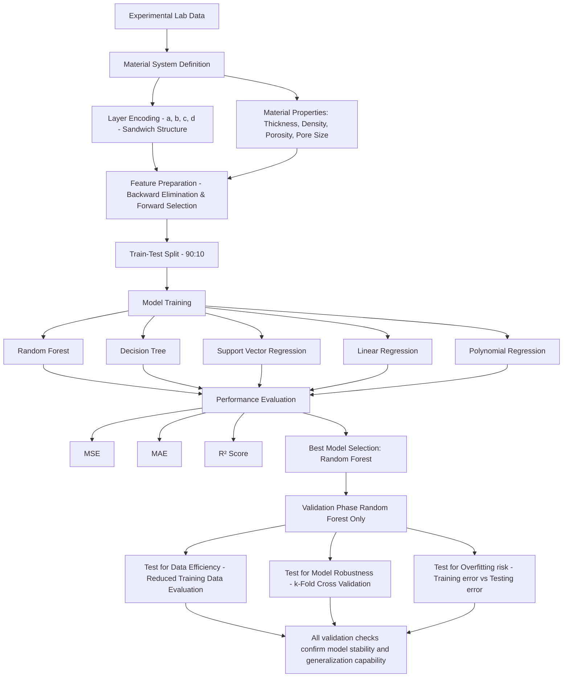

# Automotive-NVH-Acoustic-Materials-ML

Data-driven machine learning framework to predict frequency-dependent sound absorption of automotive acoustic foam (Polyurethene) materials.

⭐ **1. Introduction**

Lightweight porous foams are widely used in automotive interiors for noise reduction, passenger comfort, and vibration damping. Components such as headliners, door panels, dashboard insulation, wheel arch liners, and cabin acoustic treatments rely on carefully engineered foam structures to achieve targeted sound absorption performance across a broad frequency range.

This project investigates the relationship between the physical characteristics of polyurethane (PU)-based composite foams and their acoustic behavior. Using experimentally measured material properties (thickness, density, porosity, and pore size) and corresponding sound absorption coefficient (SAC) values as ground truth, multiple machine learning models were developed to learn and predict frequency-dependent acoustic performance of polyurethane-based foams.

   
  <b>Acoustic Insulation – Door Panels</b>

---

🧩 **2. Challenge**

Predicting the acoustic performance of porous materials such as polyurethane foams is a complex task due to the strong coupling between microstructural properties and frequency-dependent sound absorption behavior.

Experimental characterization using impedance tube testing is accurate but time-consuming, resource-intensive, and requires specialized equipment. Additionally, each material configuration must be physically fabricated and tested across multiple frequencies to obtain its full acoustic response.

Key challenges include:

* Capturing the nonlinear relationship between foam structural properties (porosity, pore size, density, thickness) and Sound Absorption Coefficient (SAC).
* Modeling frequency-dependent acoustic behavior rather than a single scalar output.
* Handling limited experimental datasets typical in materials research.
* Reducing reliance on repeated physical testing through data-driven prediction methods.

---

🎯 **3. Objectives**

This project focuses on developing a machine learning-based framework to predict the sound absorption performance of polyurethane-based composite foams for automotive acoustic applications.

Key objectives include:

* Develop regression models to predict frequency-dependent Sound Absorption Coefficients (SAC) from foam structural properties.
* Analyze the influence of material characteristics such as porosity, pore size, density, and thickness on acoustic performance.
* Assess model robustness under limited dataset conditions typical of experimental material science studies.
* Enable data-driven estimation of acoustic performance to reduce reliance on repeated impedance tube experiments.

---

🛠 4. **Tech Stack**

Key techniques used in the prediction of acoustic performance of polyurethene based composite foams include:

* Python – core implementation for data processing and machine learning models
* NumPy – numerical computations for dataset handling and feature processing
* Pandas – structured data manipulation and analysis of experimental results
* Scikit-learn – machine learning models including Random Forest, Decision Tree, SVR, and regression baselines
* Matplotlib / Seaborn – visualization of SAC trends, model performance, and feature relationships
* Jupyter Notebook – exploratory analysis and model development environment

---

🧱 5. **Test Sample Structure: 4-Layer Sandwich Configuration**

Each experimental specimen is constructed as a four-layer sandwich structure, where each layer corresponds to a specific foam type defined by its material composition (e.g., PU foam with varying natural fiber content).

The overall sample configuration is represented using a four-character code (e.g., aaaa, aaab, aaba), where:

- Each character represents one foam layer in the stack  
- Each layer has a defined material composition (PU or PU + fiber content)  
- A full 4-character code represents the complete test specimen

<table>
  <tr>
    <td align="center">
      <b>Simplified Animation of Sandwich Structure </b> 
      
    </td>
  </tr>
</table>

---

📊 **6. Data Collection for ML Model Training – Lab Tests**

The dataset used for machine learning model development is obtained from controlled laboratory experiments on polyurethane-based composite foams reinforced with natural fillers such as sawdust and rice husk.

The experimental data captures both material structural properties and acoustic response characteristics across multiple frequency ranges.

🔬 **Experimental Data Acquisition Methods:**

* Foam samples were fabricated using a single-shot free-rise polyurethane foaming process.
* Frequency-dependent Sound Absorption Coefficient (SAC) values were measured using an impedance tube setup in accordance with ASTM E1050 standards. The recorded microphone signals were post-processed in MATLAB using the transfer function method to compute the reflection coefficient, from which SAC was derived.
* Microstructural analysis was performed using FESEM imaging to capture pore morphology.
* Pore size distribution was estimated using ImageJ-based image processing techniques.
* Porosity was evaluated using a gas-based non-acoustic measurement method based on the ideal gas law.

   
  <b> Impedance Tube Setup for SAC measurement</b>

* A total of 100 sandwich-structured foam specimens were derived from laboratory experiments. Each specimen follows a 4-layer configuration, represented using a symbolic encoding scheme based on layer composition.
  * a – Pure polyurethane (PU) foam
  * b – PU foam with 5% wood powder reinforcement
  * c – PU foam with 10% wood powder reinforcement
  * d – PU foam with 15% wood powder reinforcement

---

📊 **7. Final Dataset for ML**

🧩 Independent Features (Input Variables)
* Thickness (×10⁻³ m) – Physical thickness of the foam sample, which influences sound wave propagation and energy dissipation.
* Area Density (×10⁻³ kg/m²) – Mass per unit area of the sample, representing material compactness.
* Porosity (%) – Fraction of void volume within the foam structure, affecting air flow and sound absorption.
* Pore Size (μm) – Average size of internal pores, which governs acoustic wave interaction within the material structure.

🎯 Dependent Features (Target Variables)
* Sound Absorption Coefficient (SAC) – Frequency-dependent measure of the material’s ability to absorb incident sound energy, evaluated across 6 standard central frequencies in the range 125 Hz - 4000 Hz.

---

🧠 **8. Machine Learning Pipeline Overview**

The following flowchart summarizes the complete workflow from experimental data acquisition to final model selection and validation.

